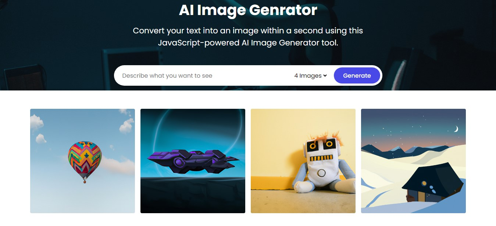
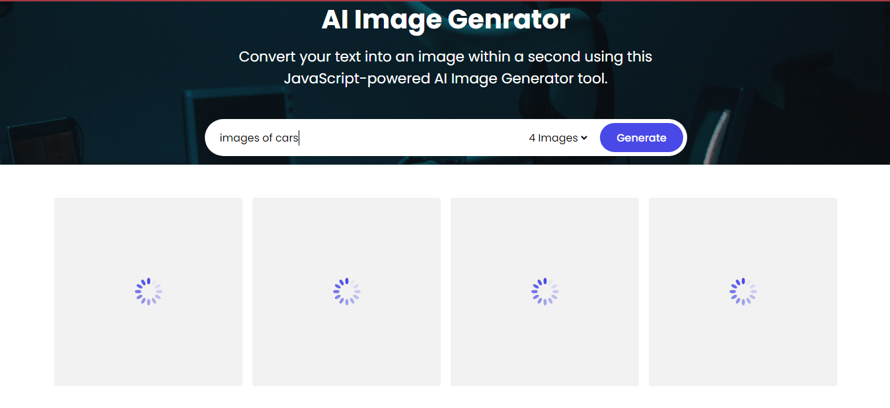

# VISTA-AI

Welcome to VISTA-AI, a web application designed to provide insights and analysis using artificial intelligence techniques.

## Overview

VISTA-AI offers a user-friendly interface for leveraging cutting-edge AI algorithms to analyze various types of data. Whether you're looking to gain insights from images, text, or other forms of data, VISTA-AI has you covered.

## Features

- **Image Analysis:** Upload images for detailed analysis including object detection, image classification, and more.
- **Text Analysis:** Input text for sentiment analysis, language detection, summarization, and other natural language processing tasks.
- **Interactive Dashboard:** Visualize results through an intuitive and interactive dashboard.
- **Customizable Settings:** Tailor analysis parameters to suit your specific requirements.
- **Easy Integration:** Seamlessly integrate VISTA-AI into your projects with our straightforward API.
- **Responsive Design:** Access VISTA-AI from any device, ensuring a seamless user experience across desktop and mobile platforms.

## Screenshots


*Caption: Example of image analysis results.*


*Caption: Interactive dashboard displaying analysis insights.*

## Getting Started

To start using VISTA-AI, you have two options:

### Direct Use

Simply visit [VISTA-AI website](https://aryagupta01.github.io/VISTA-AI/) and start exploring the features right away!

### For Development

If you want to contribute to VISTA-AI or customize it for your own needs, follow these steps:

1. Clone the repository:

    ```bash
    git clone https://github.com/AryaGupta01/VISTA-AI.git
    ```

2. Navigate to the project directory:

    ```bash
    cd VISTA-AI
    ```

3. Install dependencies:

    ```bash
    npm install
    ```

4. Run the application:

    ```bash
    npm start
    ```

5. Open your web browser and visit `http://localhost:3000` to access the local instance of VISTA-AI.

## Contributing

We welcome contributions from the community! If you'd like to contribute to VISTA-AI, please fork the [GitHub repository](https://github.com/AryaGupta01/VISTA-AI), make your changes, and submit a pull request.

## Issues and Feedback

If you encounter any issues while using VISTA-AI or have any feedback to share, please don't hesitate to [open an issue](https://github.com/AryaGupta01/VISTA-AI/issues) on GitHub.

## License

VISTA-AI is licensed under the [MIT License](LICENSE).
